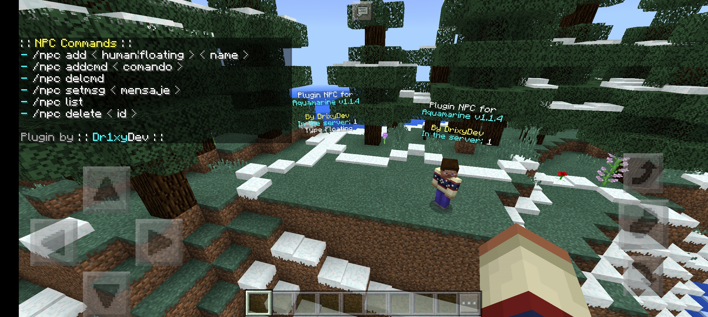

# Dr1xyNPCs

Aquamarine: https://github.com/Aquamarine-Team/Aquamarine

Advanced Plugin NPC for Aquamarine v1.1.4

A powerful and easy-to-use NPC plugin that allows you to create interactive NPCs in your PocketMine-MP server with custom commands, messages, and dynamic placeholders.

## Features

✨ **Easy NPC Creation** - Create human and floating NPCs with a simple command
🎯 **Interactive NPCs** - Assign commands or messages to NPCs that trigger on player interaction
💬 **Dynamic Messages** - Use placeholders to create dynamic, personalized messages
📍 **Multi-World Support** - NPCs work seamlessly across multiple worlds/levels
💾 **Persistent Storage** - All NPCs are saved and automatically restored on server restart
👀 **Look-At Players** - NPCs can look at nearby players (configurable per NPC)
🎨 **Custom Skins** - Human NPCs inherit the skin of the player who created them

## Plugin Example

## Commands

### `/npc add <type> <name>`
Creates a new NPC at your current position.
- `<type>`: Either `human` or `floating`
- `<name>`: The display name of the NPC
- **Example**: `/npc add human Steve the gay nigqa{n} dinerbon`

### `/npc addcmd <command>`
Sets a command to be executed when a player interacts with an NPC.
- After running this command, click on the NPC to assign the command
- **Example**: `/npc addcmd say Hello! Welcome to my shop!`

### `/npc delcmd`
Removes the command from an NPC.
- After running this command, click on the NPC to remove its command
- **Example**: `/npc delcmd`

### `/npc setmsg <message>`
Sets a message to be sent to the player when they interact with an NPC.
- After running this command, click on the NPC to assign the message
- Supports placeholders (see below)
- **Example**: `/npc setmsg Welcome %player%! There are %o% players online.`

### `/npc list`
Displays a list of all created NPCs with their ID, type, and name.
- **Example**: `/npc list`

### `/npc delete [id]`
Deletes an NPC.
- If no ID is specified, click on an NPC to delete it
- **Example**: `/npc delete 1` or `/npc delete` (then click an NPC)

## Placeholders

Use these placeholders in NPC messages to display dynamic content:

| Placeholder | Description |
|------------|-------------|
| `%n%` or `{n}` | Line break / Newline |
| `%o%` or `{o}` | Total players online on the server |
| `%player%` or `{player}` | Name of the player interacting with the NPC |
| `%worldname%` | Number of players online in a specific world (replace `worldname` with the actual world/level name) |

### Placeholder Examples
